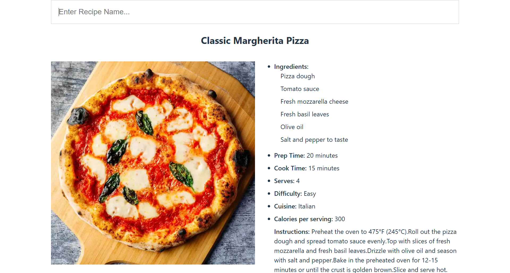

# Beginner Projects:

## 1. Accordion

### Demo: https://accordion-ui-component-vaishali.netlify.app/

## 2. Toggle Switch

### Demo: https://toggle-switch-react.netlify.app/

## 3. Star Rating

### Demo: https://star-rating-effect-react.netlify.app/

## 4. Todo List

### Demo: https://task-todo-react-app.netlify.app/

## 5. Recipe Search App

### Demo: https://recipe-search-react-by-vaishali.netlify.app/

## 6: Quotes Generator 

### Demo: https://lite-quotes-generator.netlify.app/

## 7: Product Search

### Demo: https://basic-product-search.netlify.app/

## 8: Weather App

### Demo: https://lite-weather-forecast.netlify.app/

## 9: Calculator Lite

### Demo: https://lite-calculator.netlify.app/

# Advanced Projects:

## 1. Pet Ecommerce Store

### Demo: https://pet-ecommerce-store.netlify.app/

